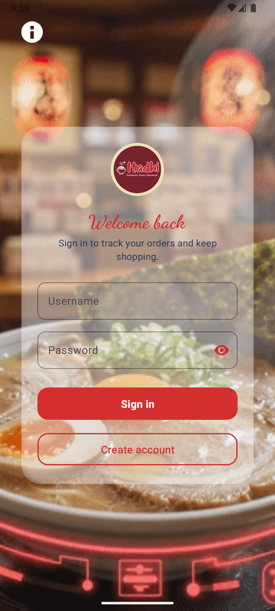
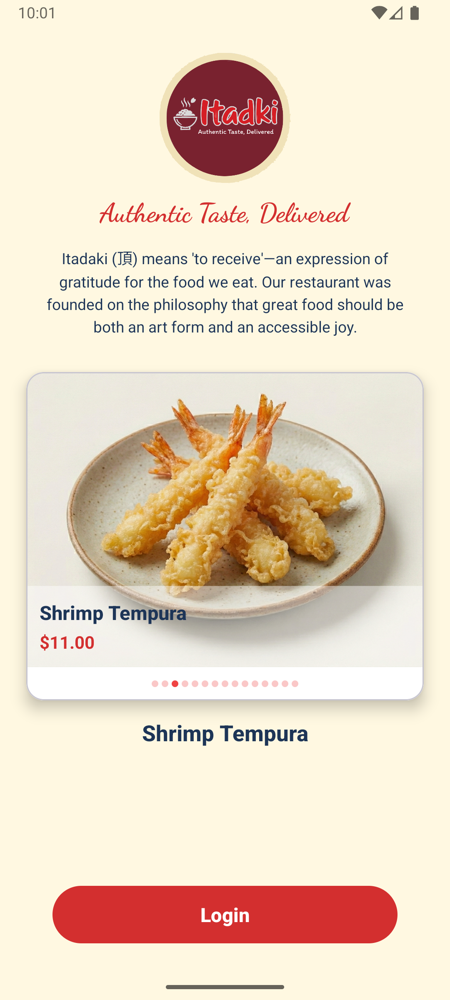

# Itadaki - Restaurant Client Android App

**A modern Android restaurant ordering system featuring Itadaki brand identity, glassmorphism UI, and real-time synchronization via WebSockets.**

---

## 📥 Download

*Note: This is a debug build. You may need to allow "Install from Unknown Sources" on your device.*

---

## 📱 About

**Itadaki** (頂 - "to receive") - A comprehensive mobile application for restaurant order management with stunning UI/UX. Built with Kotlin and Material Design 3, featuring glassmorphism effects and optimized performance.

### 📸 Screenshots

  
  
  

---

### ✨ Key Features
- 🔄 **Real-time Synchronization** - Instant order status updates via WebSockets with Double-Fetch resilience
- 🎨 **Itadaki Brand Identity** - Warm cream backgrounds with deep red accents
- 💎 **Glassmorphism UI** - Modern blur effects and frosted glass design
- 🎬 **Animated Backgrounds** - GIF animations with smart caching
- 🎠 **Auto-scrolling Carousel** - Product showcase with 15+ menu items
- ⚡ **Optimized Performance** - 60 FPS animations with adaptive quality tiers

---

### 🔄 Real-time Synchronization

The application features a robust real-time update system powered by **WebSockets**:
- **Instant Notifications**: The app stays in constant communication with the backend, receiving immediate updates for every order status change.
- **Double-Fetch Resilience**: Implements an optimistic immediate fetch followed by a secondary verification fetch to handle backend database consistency and ensure accuracy.
- **Auto-Reconnection**: Intelligent WebSocket management that automatically restores connectivity after network drops.

---

### Customer Features
- 🔐 Secure authentication with animated login
- 🍽️ Browse menu with glassmorphic cards
- 🛒 Real-time shopping cart management
- 💳 Streamlined checkout process
- 📦 Order history tracking

### Administrator Features
- 📊 Dashboard with real-time statistics
- 👥 User management (CRUD operations)
- 🍔 Product management with categories
- 📋 Order tracking and management

---

## 🛠️ Tech Stack

- **Language:** Kotlin 2.1.0
- **Architecture:** MVVM
- **UI:** Material Design 3, XML Layouts, ViewBinding
- **DI:** Hilt 2.51.1
- **Networking:** Retrofit 2.9.0, OkHttp 4.11.0, WebSocket
- **Async:** Kotlin Coroutines 1.7.3
- **Image Loading:** Coil 2.x (GIF support)
- **Glassmorphism:** BlurView 3.2.0
- **Security:** AndroidX Security Crypto
- **Min SDK:** API 33 (Android 13)
- **Target SDK:** API 36 (Android 15)

---

## ⚡ Performance & Quality

- ✅ **60 FPS** Frame Rate
- ✅ **<16ms** Blur Render Time
- ✅ **WCAG 2.1 AA** Accessibility
- ✅ **Encrypted Storage** via AndroidX Security
- ✅ **Real-time Updates** via WebSockets

---

## 📝 License

This project is licensed under the BSD 3-Clause License - see the [LICENSE](LICENSE) file for details.

---

## 🙏 Acknowledgments

- **Material Design 3** - Modern design system
- **BlurView Library** - Glassmorphism effects
- **Hilt** - Dependency injection
- **Retrofit** - REST API client

---

**Made with ❤️ by wigglebop25**

© 2026 Restaurant Client • Modern • Accessible • Performance
